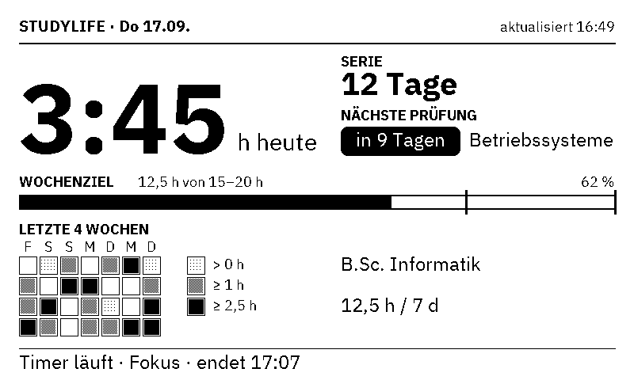
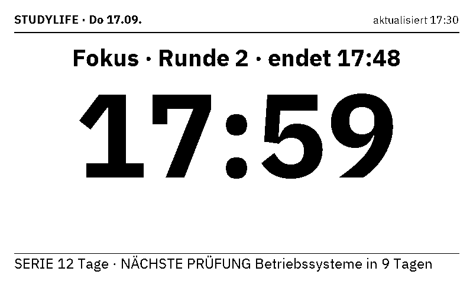
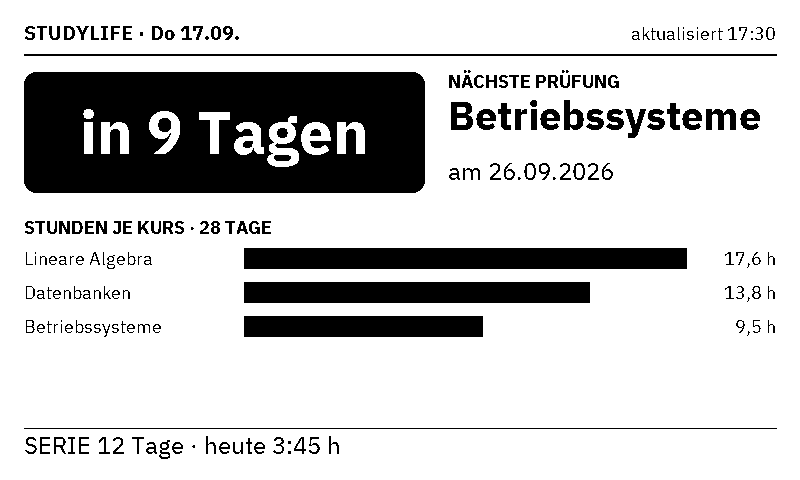
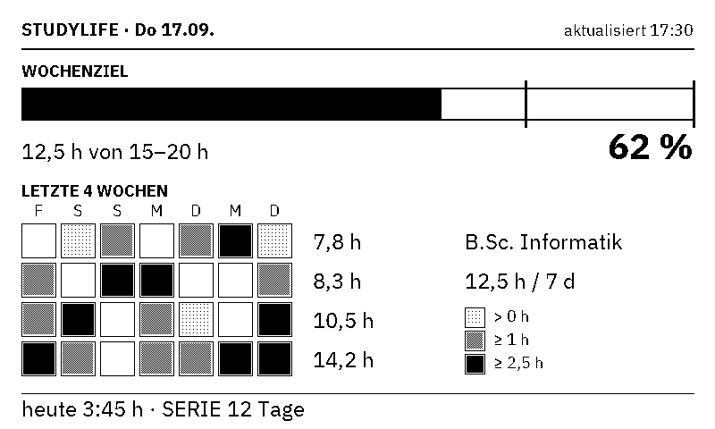
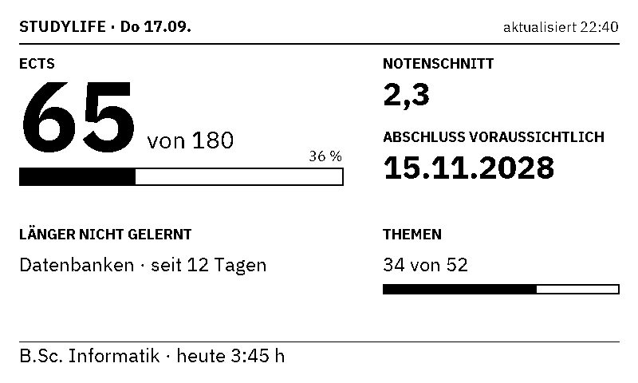
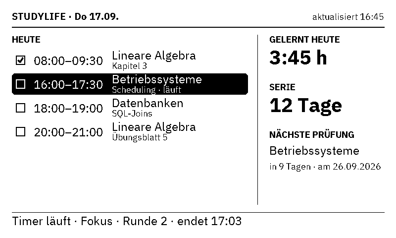
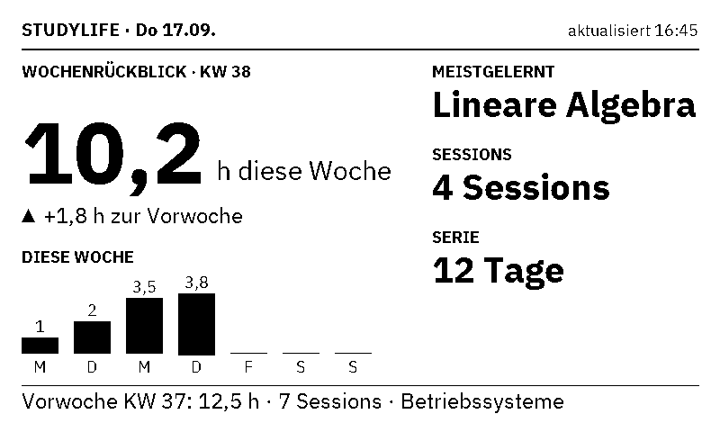

# StudyLife Display

[](https://github.com/lukislp/studylife-display/actions/workflows/ci.yml) [](https://scorecard.dev/viewer/?uri=github.com/lukislp/studylife-display) [](https://github.com/lukislp/studylife-display/security/code-scanning)
[](https://github.com/lukislp/studylife-display/releases)
[](LICENSE)
[](https://www.python.org/)

A study dashboard for [StudyLife](https://github.com/lukislp/studylife) on a 7.5" e-paper
panel: a Raspberry Pi on the desk that shows, without a screen to unlock or a tab to find,
how today is going. It reads four read-only endpoints every five minutes and redraws the
panel; between refreshes the Pi and the panel sleep. Seven layouts are built in, an "auto"
mode picks between them, and a small web interface on the Pi switches them from a phone,
connects the StudyLife account without copying a key, and holds the settings.

## What it shows



This is the `classic` layout; the others are under [Layouts](#layouts).

| Element | Source |
| --- | --- |
| Hours studied **today** (`H:MM`) | Summed from `GET /api/sessions/history` per local calendar day |
| **Serie** (streak) | `metrics/summary` → `streak.current` |
| **Nächste Prüfung** with an inverted countdown block and the course | `metrics/summary` → `upcomingCourseGoals[0]` |
| **Wochenziel** bar with the min/max target ticks | `metrics/summary` → `weekQuota` |
| **Letzte 4 Wochen** heatmap, 28 days ending today, four fill levels | `sessions/history` |
| Programme name and hours per 7 days | `metrics/summary` → `program.name`, `hours.week` |
| **Timer läuft · Fokus/Pause · endet HH:MM** while a session runs | `GET /api/timerstate` |
| `aktualisiert HH:MM · vor N min` | Set when the last fetch failed and a cached snapshot is shown |
| **Schlüssel abgelehnt** / **Daten veraltet** / **Keine Daten** | Full-screen messages instead of the dashboard, see [Error screens](#error-screens) |

The text is German by default; `DISPLAY_LANGUAGE=en` switches every label. Heatmap levels:
empty = no session, light hatch = under 1 h, dense hatch = under 2.5 h, solid = 2.5 h and more.

## Layouts

| Key | Shows | Preview |
| --- | --- | --- |
| `classic` | Everything above at a glance: today's hours, streak, countdown, week target, heatmap, timer line |  |
| `focus` | The running timer as the hero: remaining time of the phase (`MM:SS`, a snapshot as of the refresh, not a live tick), "Fokus"/"Pause" and the round; without a timer, today's hours and "kein Timer aktiv". One line with streak and next exam underneath |  |
| `exam` | The countdown as the hero: inverted "in N Tagen" block, course and date; below it hours per course over the last 28 days (top 5, from the session history) and a streak/today line |  |
| `week` | The week target as a large bar with hours, target range and percent; the 4-week heatmap large with weekday initials and per-week sums; today's hours and streak at the bottom |  |
| `semester` | ECTS earned of total as a big number with a progress bar, the average grade (or "noch keine Note"), the expected graduation date ("nicht verfügbar" / "abgeschlossen"), the course that has gone longest without a session (or "alle Kurse aktiv"), topics completed of total, and the programme name. Never picked by `auto`; all of it from `metrics/summary` (`ects`, `averageGrade`, `forecast`, `neglectedCourse`, `topics`) |  |
| `agenda` | Today's plan: the sessions planned for today from `GET /api/sessions` (up to six rows of `HH:MM–HH:MM`, course and topic; completed ones ticked, the running or next one inverted like the exam countdown, "+N weitere" when there are more, "keine Sessions geplant" when there are none), with today's hours, the streak and the next exam in a column on the right and the timer (or the week target) at the bottom. Empty when the key lacks the `Sessions.GetAll` scope |  |
| `review` | The weekly review: this week's hours large with the change against the week before (sign and an up/down marker), the course studied most, the session count and the streak on the right, the seven days Monday to Sunday as small bars, and StudyLife's own `weeklyReport` of the previous week in the footer. The hero figures are summed on the Pi from the session history for the current week, because the server's report always describes the last *completed* week |  |

Every layout keeps the header line (date, "aktualisiert HH:MM" and the stale marker), because
that line is the only way to tell an old frame from a fresh one.

`auto` (the default) picks per refresh, trying these rules in this order (the setup and
error screens are decided before any of them):

1. `review` inside the review window - by default **Sunday 18:00 to 24:00**
   (`DISPLAY_AUTO_REVIEW=sun 18-24`);
2. otherwise `exam` when the next course goal is due in **7 days or fewer** (today, overdue
   and negative counts included);
3. otherwise `focus` while a timer is running;
4. otherwise `agenda` while at least one session planned for today has not ended yet and the
   time is inside the agenda window - by default **06:00 to 12:00** (`DISPLAY_AUTO_AGENDA=06-12`);
5. otherwise `classic`.

The two windows use the quiet-hours notation with an optional list of weekdays in front
(`sun`, `sat,sun`, `mon-fri`; `24` is allowed as the end, a window may not wrap past
midnight) and can be changed on the settings page; an empty window switches that rule off.
`semester` is never chosen automatically: it is the view to switch to on purpose. The
choice comes from, in order of precedence, `settings.json` next to the cached snapshot
(written by the web interface) and the `DISPLAY_LAYOUT` variable. Switching layouts is a full
refresh of the panel like every other update. `studylife-display preview --sample --layout
<key|auto> --out frame.png` renders any of them without a panel or an instance.

## Error screens

A fetch that fails does not always mean "show the old numbers". Three situations get a
full-screen message instead of the dashboard - a headline, two lines of explanation and the
last error at the bottom - because a dashboard that looks fine but is not is the worst of
the options:

| Screen | When | What `run` does |
| --- | --- | --- |
| **Schlüssel abgelehnt** / **API key rejected** | StudyLife answered **401 or 403** | Shown right away, even with a cache: a rejected key never heals by waiting. Check `STUDYLIFE_API_KEY` and the key's scopes. Exit 1 |
| **Daten veraltet** / **Data is stale** | Every other failure, once the cached snapshot is older than `DISPLAY_STALE_ERROR_HOURS` (default 24) | Up to that age the cached dashboard is shown with the `· vor N min` marker as before; past it the screen names the age and the last error. Exit 0, the outage may end |
| **Keine Daten** / **No data** | No cache at all and the API unreachable (a fresh install with a wrong URL, typically) | Shown, exit 1 |

The last error (kind, HTTP status, message, time) is written to `status.json` in the state
directory together with the outcome of the last fetch and the time of the last panel
update; the web interface shows it above the layouts and `/healthz` reports it.

### Setup screen

A panel with **no key configured at all** (`STUDYLIFE_API_KEY` empty, as right after
`install.sh`) is not broken, so it does not get an error screen: `run` contacts nothing and
draws **Einrichtung** / **Setup** instead - "Konto verbinden unter:", the connect URL in
large text, the same URL as a QR code (scan it with a phone on the same network) and the
hostname in a small line at the bottom. Exit 0; `/healthz` says `"status": "setup"` with
HTTP 200. The URL is `DISPLAY_SETUP_URL` when set, else `<DISPLAY_PUBLIC_BASE_URL>/connect`
when that is set, else `http://<hostname>.local:<port>/connect` from the Pi's hostname and
`DISPLAY_WEB_BIND`. The first refresh after the key is applied replaces it with the
dashboard. A key that *is* configured but rejected still gets the "rejected" screen above.

## Web interface

`studylife-display serve` runs a small site on the Pi (port **8795**, `DISPLAY_WEB_BIND`)
with three pages: **Layout** starts with "Aktuell auf dem Panel", the frame that is on the
panel right now (any driver, kept upright as `current.png` in the state directory with the
time it was shown and the layout or screen kind in `current.json`; served at `/current.png`
with the cookie), then shows a preview of every layout plus `auto`, lets you pick one
("Übernehmen" saves the choice and refreshes the panel right away) and has a "Jetzt
aktualisieren" button for a refresh without a change; while no key is stored, the page also
says where to connect the account, like the setup screen; **Verbinden** connects the StudyLife
account (see [Connecting the account](#connecting-the-account)); **Einstellungen** holds
the settings that need no SSH (see [Settings in the web interface](#settings-in-the-web-interface)).
It is reachable wherever the Pi is: on the LAN as `http://<hostname>.local:8795/`, or over
Tailscale/WireGuard if the Pi is in such a network. It is plain HTTP for the LAN; do not
port-forward it to the internet.

- **The token is yours to choose.** `DISPLAY_WEB_TOKEN` (at least 12 characters) is asked for
  on the login page; the installer suggests a random one and writes it into the root-owned
  environment file, and `serve` refuses to start when the variable is empty or short. The
  code never ships a default.
- A correct token (compared in constant time; a wrong one costs a one-second delay and a 403)
  sets the cookie `studylife_display_session`: `HttpOnly`, `SameSite=Strict`, an HMAC of the
  token under a key drawn at process start. Sessions therefore end when the service restarts,
  and the token itself is never stored in the browser. Every state-changing request also
  requires a same-origin `Sec-Fetch-Site`/`Origin` header.
- **What it never does:** nothing on the layout page calls the StudyLife API. Previews are
  drawn from the cached payloads (or from sample data, marked as such, before the first
  successful fetch), and a refresh runs the same pipeline as the five-minute timer: fetch
  with cache fallback, render, show. The timer's `run` and the web service share the panel
  through a lock file (`panel.lock` in the state directory), so a click never collides with
  the scheduled refresh; the loser waits up to 60 s. The connect page is the one exception:
  it redeems the consent assertion and asks `/api/auth/whoami` whose key it holds.
- Standard library only (`http.server`), inline CSS, no external resources, usable on a phone.
  One log line per request on stderr, never containing the token or the cookie.
- The footer shows the running version. With `DISPLAY_UPDATE_CHECK=true` it also says when a
  newer release exists on GitHub: asked at most once per six hours, cached in
  `update_check.json` in the state directory, a failed check is silent. Off by default,
  because nothing on the Pi should talk to anything but the StudyLife instance unless you
  say so.
- During [quiet hours](#quiet-hours-and-the-daily-clear) the page says "Ruhezeit bis HH:MM";
  "Übernehmen" and "Jetzt aktualisieren" still work - a click is an explicit request, only
  the schedule pauses.

### Connecting the account

The `Verbinden` page obtains the API key through StudyLife's consent flow (the same one
`studylife-cli login` uses), so no key is ever displayed, copied or typed:

1. "Verbindung starten" generates a PKCE pair and a single-use state (ten minutes, kept in
   the web process's memory only) and shows the link
   `https://<instance>/connect/client/studylife-display?redirect_uri=…&state=…&code_challenge=…&code_challenge_method=S256`.
2. Open it on any device, sign in to StudyLife and approve. StudyLife redirects the browser
   to `http://localhost:8795/connect/callback?assertion=…&state=…` - an address that browser
   cannot load, on purpose: StudyLife accepts as a redirect URI only https or the
   [RFC 8252](https://www.rfc-editor.org/rfc/rfc8252#section-7.3) loopback, never the Pi's
   plain-http LAN address.
3. Copy that whole address from the address bar and paste it into the form on the page. The
   Pi checks the state, redeems the assertion together with the PKCE verifier (which never
   left the Pi, so the pasted URL alone is worth nothing to anyone else) and receives the
   key.

With an https name for the web interface, step 3 disappears: the redirect URI becomes
`<that>/connect/callback`, the web interface handles it directly, and the page says so. That
URI has to be registered on the client as well. Two ways to get an https name:

- `DISPLAY_TLS=true` serves the web interface itself over https, with the self-signed
  certificate `deploy/install.sh` generates at `/etc/studylife-display-tls.pem`. Set
  `DISPLAY_PUBLIC_BASE_URL=https://<hostname>.local:8795` (the same name the certificate
  covers) alongside it. The browser still shows the self-signed interstitial once; that is
  expected, nothing else needed - no separate infrastructure, works on any LAN.
- A Tailscale name (`DISPLAY_PUBLIC_BASE_URL=https://pi.tail.example.ts.net`) or any other
  reverse proxy terminating real TLS in front of the Pi. `DISPLAY_TLS` stays off in that case
  - the proxy is the one speaking https, not this process.

An SSH port forward (`ssh -L 8795:localhost:8795 pi@<hostname>`) has the same effect for the
loopback URI instead, since `localhost:8795` in your browser then *is* the Pi.

The key never reaches the browser. The web service (unprivileged) writes it to
`credentials.pending.json` in the state directory, readable by `pi` only;
`studylife-display-credentials.path` (root) sees the file appear and runs
`studylife-display credentials-apply`, which validates it, rewrites exactly the
`STUDYLIFE_API_KEY=` line of `/etc/studylife-display.env` (added when missing, every other
byte untouched, atomic replace, mode and owner kept), deletes the pending file, restarts
the web service and starts one refresh. The page says "Schlüssel übernommen, Dienst startet
neu"; sign in again afterwards (sessions end with the restart) and the page shows the
connected instance and what `GET /api/auth/whoami` says about the key (user ID and
credential slot - that endpoint carries no name or e-mail).

**Overlay caveat:** with the [overlay filesystem](#sd-card-protection) on, `/etc` is
RAM-backed and a key applied now is gone at the next reboot. The page warns when it
detects that; connect first, enable the overlay afterwards.

### Settings in the web interface

`Einstellungen` holds language, rotation, quiet hours, the daily clear time, the update
check and the two windows of the auto rules (weekly review, agenda). They are saved into the
same `settings.json` as the layout choice (so they survive a
reboot the same way, see [SD-card protection](#sd-card-protection)), validated with the
same rules as the environment variables (an invalid value is shown next to the field and
nothing is written), and take precedence over the environment: `run`, `serve` and `check`
all read the effective values through one `effective_settings()` step. "Auf Umgebungswerte
zurücksetzen" removes them again; the layout choice stays. The refresh interval is
systemd's (`studylife-display.timer`) and is shown read-only, as are the environment-only
values (instance URL, key and token as set/not set, time zone, paths, bind address).

### Health endpoint

`GET /healthz` answers without a cookie (the same-origin rules do not apply either; it is
read-only and carries nothing secret) with JSON for an uptime monitor:

```json
{"status": "ok", "setup": false, "version": "1.3.0",
 "last_fetch_at": "2026-09-17T16:45:00+02:00",
 "last_fetch_ok": true, "stale_minutes": 3, "last_error": null,
 "last_panel_update_at": "2026-09-17T16:45:04+02:00", "layout": "classic",
 "quiet_hours_active": false, "sessions_ok": true}
```

| `status` | HTTP | Meaning |
| --- | --- | --- |
| `setup` | 200 | No API key is configured yet; the panel shows the [setup screen](#setup-screen) (`setup` is `true`) |
| `ok` | 200 | The last fetch succeeded and the snapshot is fresh |
| `degraded` | 200 | The last fetch failed and the cached dashboard (or the stale screen) is shown, or the snapshot is older than 15 minutes outside quiet hours - the timer is not running |
| `error` | 503 | The key was rejected, or there is no data at all |

`last_error` is `null` or `{"kind": "rejected"|"stale"|"no_data"|"transient", "status": 403,
"message": "...", "at": "..."}`. For **Uptime Kuma**: monitor type *HTTP(s) - Keyword* or
*JSON Query*, URL `http://<hostname>:8795/healthz`, expected keyword `"status": "ok"` (or JSON
query `status` == `ok`); a plain HTTP monitor only catches `error`, since `degraded` is a 200.
`sessions_ok` is `false` when the last fetch got everything but the session list (a key
without the `Sessions.GetAll` scope, typically): the dashboard is fine, only the agenda is
empty, and the layouts page says why. Set the interval to a few minutes; the endpoint reads
two small files and never calls StudyLife.

## Hardware

- Raspberry Pi 3 Model A+ (any Pi with the 40-pin header works; the 3A+ is small, fanless and
  has Wi-Fi)
- [Waveshare 7.5inch e-Paper HAT (V2)](https://www.waveshare.com/7.5inch-e-paper-hat.htm),
  800 x 480, black/white. The V2 is the current panel with the 24-pin FPC connector.
- Official micro-USB power supply (5.1 V / 2.5 A); the panel draws almost nothing but the Pi
  browns out on a phone charger during Wi-Fi bursts
- A microSD card (8 GB is plenty) and, optionally, a frame

### Wiring

None to speak of: the driver board plugs onto the 40-pin header as a HAT, and the panel's
FPC cable goes into the driver board's connector (contacts facing the board, latch closed).
Set the driver board's switches to **B** (0.47R, the setting for the V2 panel) and **0**
(4-line SPI). No soldering anywhere.

## StudyLife setup

Register the display as a client on your StudyLife instance through
[studylife-developers](https://github.com/lukislp/studylife-developers), once:

| Field | Value |
| --- | --- |
| Client ID | `studylife-display` |
| Requested scopes | `Metrics.GetSummary`, `Sessions.GetAll`, `Sessions.GetHistory`, `TimerState.Get` |
| Redirect URIs | `http://localhost:8795/connect/callback` (the port from `DISPLAY_WEB_BIND`), plus `https://<DISPLAY_PUBLIC_BASE_URL>/connect/callback` if you use one |

| Scope | Endpoint |
| --- | --- |
| `Metrics.GetSummary` | `GET /api/metrics/summary` |
| `Sessions.GetAll` | `GET /api/sessions` (the full list incl. planned sessions, for the `agenda` layout; polled with `If-None-Match`, so an unchanged list costs a 304 and no body) |
| `Sessions.GetHistory` | `GET /api/sessions/history?days=28&onlyCompleted=true` |
| `TimerState.Get` | `GET /api/timerstate` |

`Auth.Whoami` is implied for every key. Nothing here writes: the display cannot start,
stop or change a session, so a key that ends up on a lost SD card can only ever read your
study statistics. `Sessions.GetAll` is the one scope that is optional in practice: a key
issued without it (every key from before the `agenda` layout existed) still drives every
other layout, the session list is simply treated as empty, the refresh logs a warning, and
`/healthz` and the layouts page say so (`sessions_ok`). To get the agenda, add the scope to
the client in studylife-developers and connect again so that a key with all four scopes is
issued. Then put the instance URL into `/etc/studylife-display.env` and connect
from the web interface (`http://<hostname>.local:8795/connect`, see
[Connecting the account](#connecting-the-account)); the key lands in the environment file
by itself. Issuing a key by hand in studylife-developers and pasting it into
`STUDYLIFE_API_KEY=` still works and stays the fallback.

Configuration (environment, or `/etc/studylife-display.env` on the Pi). The values marked
*web* can also be set on the settings page, which then takes precedence:

| Variable | Default | Meaning |
| --- | --- | --- |
| `STUDYLIFE_BASE_URL` | – | Your instance, e.g. `https://studylife.example.com` |
| `STUDYLIFE_API_KEY` | – | Filled in by the connect page; or a key issued by hand. Empty until then |
| `STUDYLIFE_TIMEZONE` | `Europe/Berlin` | Time zone of the **server**; its timestamps carry no offset |
| `DISPLAY_LANGUAGE` | `de` | `de` or `en` (*web*) |
| `DISPLAY_DRIVER` | `waveshare` | `waveshare` (the panel) or `file` (a PNG) |
| `DISPLAY_OUTPUT_PATH` | `./frame.png` | Where the `file` driver writes |
| `DISPLAY_ROTATE` | `0` | `180` when the panel is mounted upside down; applied by the driver, anything but 0/180 is refused (*web*) |
| `DISPLAY_STATE_PATH` | `/var/lib/studylife-display/last.json` | Cached last snapshot; `settings.json`, `status.json`, `current.png`/`current.json` (the frame on the panel), `last_clear`, `update_check.json`, `panel.lock` and the short-lived `credentials.pending.json` live in the same directory |
| `DISPLAY_STALE_ERROR_HOURS` | `24` | Age of the cached snapshot from which the stale screen replaces the dashboard |
| `DISPLAY_QUIET_HOURS` | – | `HH-HH` or `HH:MM-HH:MM`, may wrap past midnight (`23-7`); no scheduled refresh inside. Empty = off (*web*) |
| `DISPLAY_CLEAR_AT` | `04:00` | Time of the daily full clear against ghosting; empty = off (*web*) |
| `DISPLAY_UPDATE_CHECK` | `false` | Let the web interface ask GitHub (once per 6 h) whether a newer release exists (*web*) |
| `DISPLAY_AUTO_UPDATE` | `false` | Let `studylife-display-update.timer` install a newer release once a day, unattended; see [Updating](#updating) |
| `DISPLAY_LAYOUT` | `auto` | `auto`, `classic`, `focus`, `exam`, `week`, `semester`, `agenda` or `review`; overridden by the choice made in the web interface |
| `DISPLAY_AUTO_REVIEW` | `sun 18-24` | Window of the `review` rule in `auto`: `[weekdays] HH-HH` or `HH:MM-HH:MM` (`24` = midnight, no wrap past midnight); empty = rule off (*web*) |
| `DISPLAY_AUTO_AGENDA` | `06-12` | Window of the `agenda` rule in `auto`, same notation; empty = rule off (*web*) |
| `DISPLAY_PERSIST_PATH` | `/boot/firmware/studylife-display/settings.json` | Copy of the web interface's choice on the boot partition, restored at boot (see [SD-card protection](#sd-card-protection)); empty disables it |
| `DISPLAY_WEB_BIND` | `0.0.0.0:8795` | Where `serve` listens |
| `DISPLAY_WEB_TOKEN` | – | Access token of the web interface, at least 12 characters; `serve` refuses to start without one |
| `DISPLAY_TLS` | `false` | Serve the web interface over https with the self-signed certificate `deploy/install.sh` generates. Pairs with `DISPLAY_PUBLIC_BASE_URL` below; see [Connecting the account](#connecting-the-account) |
| `DISPLAY_PUBLIC_BASE_URL` | – | Optional https URL under which the web interface is reachable (`DISPLAY_TLS=true` plus this Pi's own name, or a Tailscale name); the connect flow then redirects straight back to `<url>/connect/callback`. Must be registered on the client too |
| `DISPLAY_SETUP_URL` | – | Optional: the exact URL the [setup screen](#setup-screen) shows and encodes in its QR code. Empty derives it from `DISPLAY_PUBLIC_BASE_URL` or the hostname and `DISPLAY_WEB_BIND` |
| `HTTP_TIMEOUT_SECONDS` | `10` | Per request |

`STUDYLIFE_TIMEZONE` matters more than it looks: StudyLife serialises every DateTime as naive
local time of the server, and a freshly imaged Pi runs on UTC. "Today" is the calendar day in
that zone, and a session from 23:30 to 00:30 counts half an hour on each of the two days.

## Install on the Pi

1. Flash **Raspberry Pi OS Lite (64-bit)** with Raspberry Pi Imager. In the Imager's
   settings set the hostname, the `pi` user and password, Wi-Fi and SSH ("headless"); no
   monitor is ever needed.
2. SSH in and run the installer:

   ```bash
   sudo apt-get install -y git
   git clone https://github.com/lukislp/studylife-display.git
   sudo bash studylife-display/deploy/install.sh
   ```

   It installs the system packages Pillow needs, enables SPI, checks out the **latest
   release tag** under `/opt/studylife-display/src` (`--main` tracks `main` instead, for
   developers), creates a virtualenv in `/opt/studylife-display`, installs this package
   with the `pi` extra (the Waveshare library straight from its git repository plus
   `spidev`, `gpiozero`, `lgpio`), writes a template `/etc/studylife-display.env`, asks
   for the web interface's access token (Enter accepts the suggested random one), and
   enables the systemd timer, the web service, the two root-only units that carry the
   settings across reboots and the one that applies the API key. Re-running it updates the
   code and never overwrites an existing env file; for updates see [Updating](#updating).
   After `install.sh` the panel shows the [setup screen](#setup-screen) with the QR code of
   the connect page; it stays until a key is applied.
3. Put the instance URL into `/etc/studylife-display.env`, restart the web service
   (`sudo systemctl restart studylife-display-web.service`) and connect the account at
   `http://<hostname>.local:8795/connect` - scan the QR code on the panel, or type the URL
   (see [Connecting the account](#connecting-the-account)). The key is applied and the first
   refresh runs by itself; `journalctl -u studylife-display.service -n 50` shows it. The
   fallback is a key issued by hand in `STUDYLIFE_API_KEY=` followed by
   `sudo systemctl start studylife-display.service`.

   From then on the timer runs `studylife-display run` every five minutes, and
   `http://<hostname>.local:8795/` switches layouts (see [Web interface](#web-interface)).

### SD-card protection

A Pi that refreshes a panel for years should not be writing to its SD card at all. After the
installer has run, the account is connected and the first refresh has worked (the key lives
in `/etc`, which the overlay turns into RAM - connect first):

```bash
sudo raspi-config nonint enable_overlayfs   # root filesystem read-only, writes go to RAM
sudo sed -i 's/^#\?Storage=.*/Storage=volatile/' /etc/systemd/journald.conf
sudo reboot
```

With the overlay on, `/var/lib/studylife-display/last.json` lives in RAM too, which is fine:
the cache only needs to survive until the next successful fetch, not a reboot. To change the
configuration later, `sudo raspi-config nonint disable_overlayfs`, reboot, edit, re-enable.

The layout and the settings chosen in the web interface (`settings.json` in the same
directory) would be lost the same way, so the file is mirrored to the **boot partition**,
the one part of the SD card the overlay leaves writable (`/boot/firmware`, owned by root):

- The web service keeps writing `settings.json` into the state directory exactly as before;
  it runs unprivileged and never touches the boot partition.
- `studylife-display-persist.path` watches that file and, on every change, runs
  `studylife-display-persist.service` as root: `studylife-display persist-export` copies
  the file to `DISPLAY_PERSIST_PATH` (default `/boot/firmware/studylife-display/settings.json`),
  atomically and only after validating it, and skips the write when the copy is already
  current.
- `studylife-display-restore.service` runs `studylife-display persist-import` once per boot,
  after the boot partition is mounted and before the timer and the web service start. It
  copies the file back if there is one, and never replaces a valid local file with a
  damaged or older copy.

Root is needed because the boot partition is root-owned and the two services above are the
only ones that get it; they are locked down to those two directories (`ProtectSystem=strict`,
no network, no devices) and the timer and web units stay exactly as unprivileged as before.
Without the overlay the mechanism is a harmless no-op: the local file survives on its own,
the copy on the boot partition just mirrors it. The installer picks `/boot` on images that
still mount the boot partition there, and disables the mirror (`DISPLAY_PERSIST_PATH=`) when
neither is a separate mount. The file is tiny and changes only when you switch layouts, so
the extra writes to the boot partition are not what SD-card protection is about.

The API key takes the same root-only road in the other direction: the web service writes
`credentials.pending.json` into the state directory, `studylife-display-credentials.path`
starts `studylife-display-credentials.service` (root, `credentials-apply`), which puts the
key into `/etc/studylife-display.env` and deletes the file. That unit may write `/etc` and
the state directory and nothing else.

### Updating

```bash
sudo bash /opt/studylife-display/src/deploy/update.sh --check   # installed vs latest release, exit 1 when behind
sudo bash /opt/studylife-display/src/deploy/update.sh           # update to the latest release
sudo bash /opt/studylife-display/src/deploy/update.sh --tag v1.3.0
```

The script asks GitHub for the latest release (no token needed), fetches the tags, checks
the tag out under `/opt/studylife-display/src`, reinstalls the package into the virtualenv,
re-installs the unit files from `deploy/` (so a unit added by the release lands), reloads
systemd, restarts the web service and runs one refresh. Running it on the tag that is
already installed does nothing but say so; `--force` reinstalls anyway. The version the
web footer and `/healthz` report is the tag the checkout sits on.

**With the overlay filesystem on, the update would be lost at the next reboot**: `/opt` and
`/etc` are RAM-backed then. The script detects it (`raspi-config nonint get_overlay_now`, or
an `overlay` root mount in `/proc/mounts`) and refuses; the three steps are

```bash
sudo raspi-config nonint disable_overlayfs && sudo reboot
sudo bash /opt/studylife-display/src/deploy/update.sh
sudo raspi-config nonint enable_overlayfs && sudo reboot
```

`--force` runs it anyway, for a test that may be gone tomorrow. `--check` is fine with the
overlay on (it changes nothing), so a cron line or the web footer's update hint
(`DISPLAY_UPDATE_CHECK=true`) can tell you when the three steps are worth it.

`studylife-display-update.timer` runs `update.sh` once a day (03:00, spread over an hour) but
does nothing unless `DISPLAY_AUTO_UPDATE=true` is set in the environment file - off by
default, since nothing should change on its own without asking. Turning it on is enough;
`update.sh` is a no-op when already on the latest release, so most days it changes nothing.
With the overlay filesystem on, the daily run just logs the same "overlay filesystem is on"
refusal `--check` would (see above) - it will not brick anything, it just never updates.

### Quiet hours and the daily clear

`DISPLAY_QUIET_HOURS=23-7` (or `22:30-06:15`; the window may wrap past midnight, the start
is inclusive and the end exclusive) makes the scheduled `run` exit 0 without fetching or
drawing - one log line, no flicker in a dark room, no API calls at night. The web
interface's buttons still work inside the window, and its page says "Ruhezeit bis 07:00".

E-paper keeps faint traces of earlier frames. `DISPLAY_CLEAR_AT=04:00` (default; empty
turns it off) makes the first scheduled `run` at or after that time do a full clear to
white before drawing the frame, once per day (`last_clear` in the state directory
remembers it; a slot missed while the Pi was off is caught up on the next run). The daily
clear runs **inside quiet hours too** - it is the one refresh that matters - and only from
the timer, never from a click in the web interface. With the `file` driver the clear writes
`frame-clear.png` next to the output.

### Refresh cadence, and why full refresh only

The timer fires every five minutes (`OnUnitActiveSec=5min`, first run one minute after boot)
and every refresh is a **full** refresh: `init()`, one complete frame, `sleep()`. Waveshare's
documentation and the panel vendor both warn against continuous partial refreshes - they
accumulate ghosting and, done for months, damage the panel - and recommend a full refresh at
least every few partial ones and never more often than a few times a minute. At one full
refresh per five minutes the panel is well inside its rated lifetime and the ~5 s flicker is a
non-event. Updating only the timer line with a partial refresh between full ones is a
possible follow-up; it is deliberately not in this version.

The dashboard is drawn 800 x 480 with the panel in landscape orientation. If yours is mounted
the other way round, set `DISPLAY_ROTATE=180`: the driver turns the finished frame right
before showing it, the layouts (and their golden frames) stay upright.

## Troubleshooting

| Symptom | Check |
| --- | --- |
| `No module named waveshare_epd` | The `pi` extra did not install: `sudo /opt/studylife-display/venv/bin/pip install '/opt/studylife-display/src[pi]'` |
| `FileNotFoundError: /dev/spidev0.0` | SPI is off: `sudo raspi-config nonint do_spi 0` and reboot |
| `Permission denied: /dev/spidev0.0` or GPIO errors | The `pi` user is not in `spi`/`gpio`: `sudo usermod -aG spi,gpio pi`, then log in again |
| Panel stays white, service exits 0 | Driver-board switches (B / 0) and the FPC cable's orientation |
| Header shows `· vor N min` | The last fetch failed; `journalctl -u studylife-display.service` names the reason, and so does `/healthz` |
| Panel says **Schlüssel abgelehnt** / **API key rejected** | StudyLife answered 401/403: no key yet, the key is wrong or misses a scope (`Metrics.GetSummary`, `Sessions.GetHistory`, `TimerState.Get`); connect again from `/connect` (or fix `/etc/studylife-display.env`) and `sudo systemctl start studylife-display.service` |
| `agenda` says **keine Sessions geplant** although sessions are planned; `/healthz` has `"sessions_ok": false` | The key lacks `Sessions.GetAll` (keys from before that scope was requested); the journal shows "could not fetch the session list". Add the scope to the client in studylife-developers and connect again |
| Connect page: StudyLife shows an error instead of the consent screen | The client `studylife-display` is not registered on that instance, or the redirect URI (`http://localhost:8795/connect/callback`, or the `DISPLAY_PUBLIC_BASE_URL` one) is not on its list - the server matches it character for character |
| Connect page says "Schlüssel übernommen" but the key never arrives | `journalctl -u studylife-display-credentials.service -n 20`; `systemctl status studylife-display-credentials.path` must be active. With the overlay on, the key is gone after a reboot: disable it, connect, re-enable |
| Connect page says the pasted address does not belong to this attempt | The link was regenerated (or the web service restarted) in between; generate a new link and go through StudyLife again |
| Panel says **Daten veraltet** / **Data is stale** | No successful fetch for `DISPLAY_STALE_ERROR_HOURS`; the last error is on the screen and in `/healthz` |
| Panel says **Keine Daten** / **No data** | The very first fetch failed and there is nothing to fall back to; `studylife-display check` shows the API error |
| The panel does not refresh at night | `DISPLAY_QUIET_HOURS` is set; `journalctl -u studylife-display.service` shows "quiet hours ... not refreshing" |
| `update.sh` refuses with "overlay filesystem is on" | Expected, see [Updating](#updating): disable the overlay, reboot, update, re-enable, reboot |
| Session times off by an hour or two | `STUDYLIFE_TIMEZONE` must be the server's zone, not the Pi's |
| Web interface does not answer | `journalctl -u studylife-display-web.service -n 20`; `DISPLAY_WEB_TOKEN` missing or shorter than 12 characters makes `serve` exit immediately |
| Refresh from the browser reports "busy" or waits | The timer's refresh holds `panel.lock`; it is over within seconds, a stuck one times out after 60 s |
| Layout choice falls back to `DISPLAY_LAYOUT` after a reboot | `journalctl -u studylife-display-persist -u studylife-display-restore -n 20`; after a choice in the web interface `ls /boot/firmware/studylife-display/` must show `settings.json`, and `systemctl status studylife-display-persist.path` must be active |
| `studylife-display check` | Calls the four endpoints and prints what the dashboard would be built from, without touching the panel |

## Development

```bash
uv sync
uv run studylife-display preview --sample --out frame.png   # no instance needed
uv run studylife-display preview --sample --layout semester --out frame.png
uv run studylife-display preview --out frame.png            # against your instance (.env)
STUDYLIFE_API_KEY= DISPLAY_SETUP_URL=http://pi.local:8795/connect \
  uv run studylife-display preview --out setup.png          # the setup screen, no API call
DISPLAY_DRIVER=file DISPLAY_STATE_PATH=./state/last.json DISPLAY_WEB_TOKEN=local-dev-token \
  uv run studylife-display serve                            # http://127.0.0.1:8795/
uv run pytest
uv run ruff check .
uv run ruff format --check .
uv run mypy
```

The `pi` extra is not installed by `uv sync` and is never imported outside
`WaveshareDisplay.__init__`, so everything - including the render tests - runs on a laptop.
`tests/golden/<layout>_<language>.png` are the reference frames; after an intentional layout
change regenerate them with `uv run pytest --update-goldens` and commit the result together
with the previews in `docs/` (`uv run studylife-display preview --sample --layout <key> --out
docs/preview-<key>.png` for each of the seven; `docs/preview.png` is the classic one).
Layouts live in `src/studylife_display/layouts/`, one module each, registered in
`layouts/__init__.py`; the drawing helpers they share are in `layouts/common.py`, the error
screens in `layouts/error.py`, the setup screen (QR code via `segno`, drawn module by module)
in `layouts/setup.py`. Rotation is applied in `driver.py` only, so the goldens are
always upright.

The version comes from the git tag the checkout sits on (`hatch-vcs`; `1.2.1.devN+g...`
between tags, `0.0.0` without git metadata), which is what `studylife-display --version`,
the web footer and `/healthz` report. The `version` line `uv sync` rewrites in `uv.lock`
for the root project is noise from that and need not be committed.

`tests/test_wire_fields.py` pins every JSON field name the code reads to the verified
StudyLife wire format. StudyLife never errors on an unknown field, so this test is what
turns a typo into a red build instead of a dashboard that silently shows zeros.

The fonts are IBM Plex Sans Regular and Bold (SIL Open Font License 1.1, see
`src/studylife_display/fonts/OFL.txt`).

## Licence

AGPL-3.0-or-later — see [LICENSE](LICENSE).
